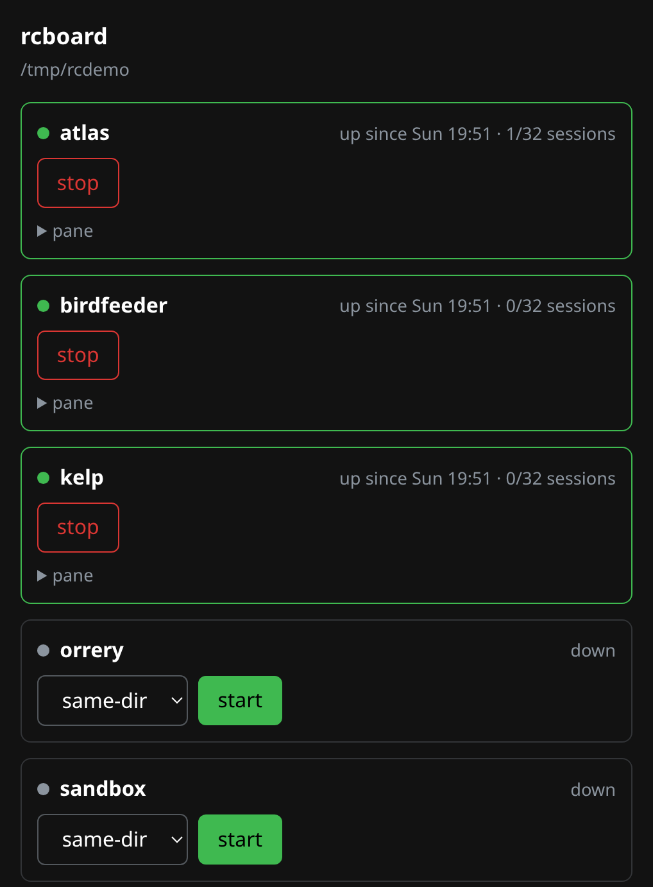

# rcboard

Claude Desktop and iOS are not, shall we say, the most polished for starting a new session on a remote machine.

`rcboard` is a tiny go application that serves a web page on localhost:7777. There is no access control or authentication. I expose it to my tailnet only. Treat tailnet membership as root on the host: any device on the tailnet, or anything running on one, can start an autonomous `claude` with write access to every directory under the root. Although I'd guess you'd also need to hijack my Claude account too. Anyway.

The page lists all the project directories in `~/code` and provides a little interface that starts and stops tmux-managed `claude remote-control` instances inside. You can then start new sessions from the app as normal. I've had problems with hooks in particular not firing if I use a Claude Desktop created remote session, for example, but this gives you "proper" CLI sessions in the right directory.

Servers start with `--permission-mode auto --name <project>`, so the pre-created session carries the project name in the app. The app also force-enables workspace trust on that project directory, if it isn't already set.

  

## install

    go build -o ~/.local/bin/rcboard .
    cp deploy/rcboard.service ~/.config/systemd/user/
    systemctl --user enable --now rcboard
    tailscale serve --bg 7777

Then open `https://machine.tailnet.ts.net` on your phone.

## flags

    -root    directory whose subdirectories are projects (default ~/code)
    -listen  bind address (default 127.0.0.1:7777)
